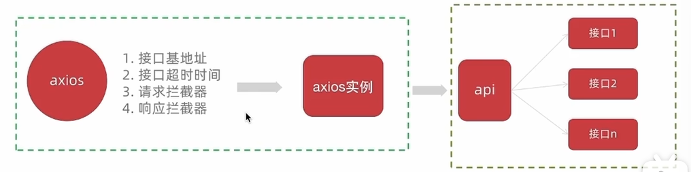

#### 1. 创建项目

```sh
npm init vue@latest
```

#### 2. 项目文件


#### 3. git 管理项目

基于 create-vue 创建出来的项目默认没有初始化 git 仓库,需要我们手动初始化

- 执行命令并完成首次提交
  1. git init
  2. git add .
  3. git commit -m "init"

#### 4. 什么是别名路径联想提示

在编写代码的过程中，一旦输入 @/ , VSCode 会立刻联想出 src 下的所有子目录和文件,统一文件路径访问不容易出错

- 如何进行配置

  1. 在项目的根目录下新增 jsconfig.json 文件
  2. 添加 json 格式的配置项，如下:

  ```json
  {
    "compilerOptions": {
      "baseUrl": "./",
      "paths": {
        // ==> 输入@自动联想src目录
        "@/*": ["src/*"]
      }
    }
  }
  ```

#### 5. Element plus 按需引入

- 安装

  ```sh
  npm install element-plus --save
  ```

- 自动导入（推荐）
  首先你需要安装 unplugin-vue-components 和 unplugin-auto-import 这两款插件

  ```sh
  npm install -D unplugin-vue-components unplugin-auto-import
  ```

  vite 中配置

  ```js
  // vite.config.ts
  import { defineConfig } from "vite";
  import AutoImport from "unplugin-auto-import/vite";
  import Components from "unplugin-vue-components/vite";
  import { ElementPlusResolver } from "unplugin-vue-components/resolvers";

  export default defineConfig({
    // ...
    plugins: [
      // ...
      AutoImport({
        resolvers: [ElementPlusResolver()],
      }),
      Components({
        resolvers: [ElementPlusResolver()],
      }),
    ],
  });
  ```

#### 6. element plus 主题定制

- 为什么需要主题定制？

  小兔鲜主题色和 elementPlus 默认的主题色存在冲突，通过定制主题让 elementPlus 的主题色和小兔鲜项目保持一致

- 如何定制(scss 变量替换方案)

  - 安装 SCSS
    ```sh
    npm i sass -D
    ```
  - 准备定制样式文件

    ```
    styles/ element/index.scss
    ```

  - 对 ElementPlus 样式进行覆盖

    通知 Element 采用 scss 语言 -> 导入定制 scss 文件覆盖

  - 这里自动导入需要深入到 elementPlus 的组件中，按照官方的配置文档来

    1. 配置 elementPlus 采用 sass 样式配色系统
    2. 自动导入定制化样式文件进行样式覆盖

    ```js
    // vite.config.js
    import { fileURLToPath, URL } from "node:url";

    import { defineConfig } from "vite";
    import vue from "@vitejs/plugin-vue";

    // Element plus 按需导入
    import AutoImport from "unplugin-auto-import/vite";
    import Components from "unplugin-vue-components/vite";
    import { ElementPlusResolver } from "unplugin-vue-components/resolvers";

    // https://vitejs.dev/config/
    export default defineConfig({
      plugins: [
        vue(),
        AutoImport({
          resolvers: [ElementPlusResolver()],
        }),
        Components({
          // 1.配置elementPlus采用sass样式配色系统
          resolvers: [ElementPlusResolver({ importStyle: "sass" })],
        }),
      ],
      resolve: {
        alias: {
          // 将 @ 转为 ./src
          "@": fileURLToPath(new URL("./src", import.meta.url)),
        },
      },
      css: {
        preprocessorOptions: {
          scss: {
            additionalData: `@use "@/styles/element/index.scss" as *;`,
          },
        },
      },
    });
    ```

    ```scss
    // 只需重写需要的即可
    @forward "element-plus/theme-chalk/src/common/var.scss" with (
      $colors: (
        "primary": (
          "base": #27ba9b,
        ),
        "success": (
          "base": #1dc779,
        ),
        "warning": (
          "base": #ffb302,
        ),
        "danger": (
          "base": #e26237,
        ),
        "error": (
          "base": #cf4444,
        ),
      )
    );
    ```

#### 7. axios 基础配置

1. 安装

```sh
npm i axios
```

2. 配置基础实例(统一接口配置)


